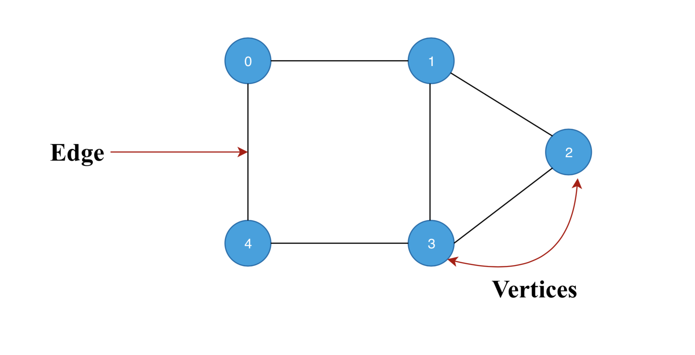
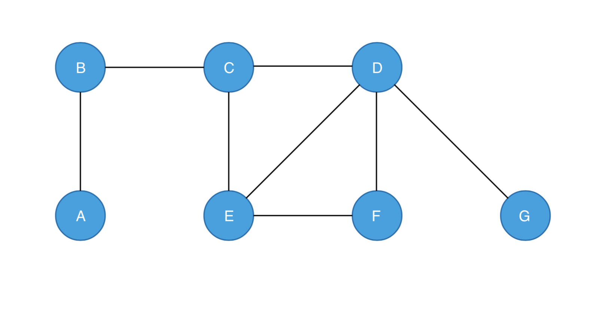
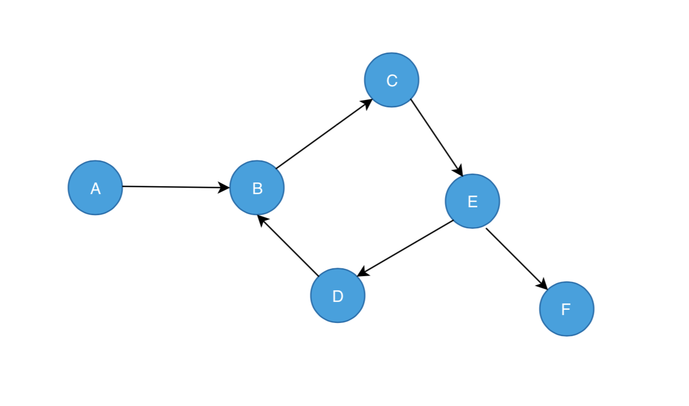

### Graphs Definition

A graph is a pictorial representation of a set of objects where some pairs of objects are connected by links. The interconnected objects are represented by points termed as vertices, and the links that connect the vertices are called **edges**.

### Pictorial Representation of Graph

### Types of Graphs
   - Undirected Graph
   - Directed Graph

### Pictorial Representation of Undirected Graph

### Pictorial Representation of Directed Graph

