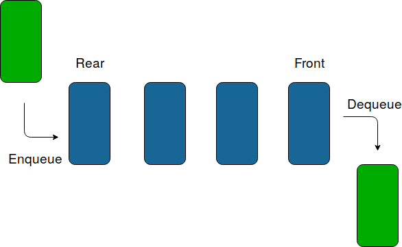
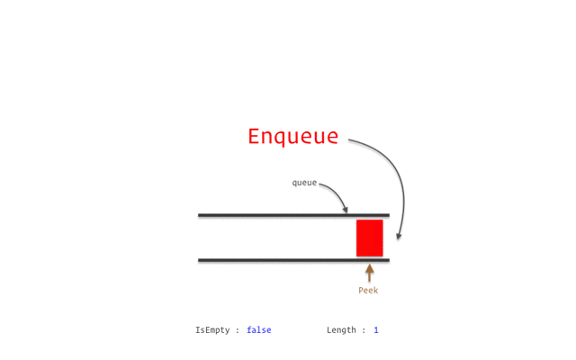

### Queues Definition

**A Queue is a linear structure which follows a particular order in which the operations are performed.**

The order is First In First Out (FIFO). A good example of a queue is any queue of consumers for a resource where the consumer that came first is served first.
### Pictorial Representation of Queue
 
### Pictorial Represenation of Enqueue and Dequeue Operation
 

### Pictorial Representation of Circular Queue using Arrays

