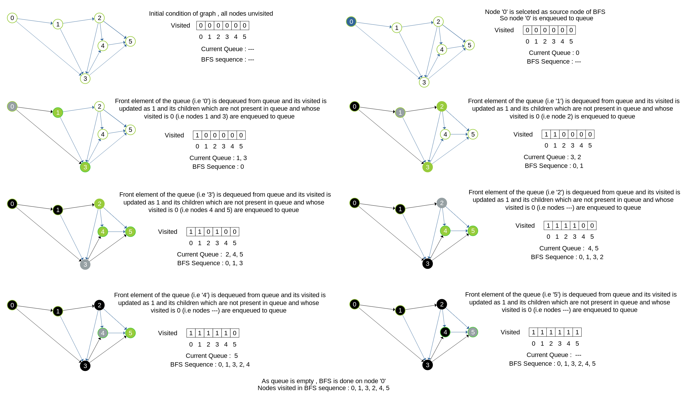

### Let's see concept of BFS
<iframe src="https://www.youtube.com/embed/ivW2JAF9-Tw" frameborder="0" allow="autoplay; encrypted-media" allowfullscreen></iframe>

### BFS Algorithm

The algorithm starts with examining the source node and all of its neighbours. In the next step, the neighbours of the nearest node of the source node are explored. The algorithm then explores all neighbours of all the nodes and ensures that each node is visited exactly once and no node is visited twice.

**STEP 1**: Set visited as 0 for all nodes in the Graph.
**STEP 2**: Enqueue the selected source node into the queue.
**STEP 3**: Dequeue a node N from queue and update its visited as 1.
**STEP 4**: Enqueue all the neighbours of node N which are not present in the queue and whose visited is 0.
**STEP 5**: Repeat steps 3 and 4 until queue is empty.
**STEP 6**: EXIT
 
### An example which explains BFS Algorithm

